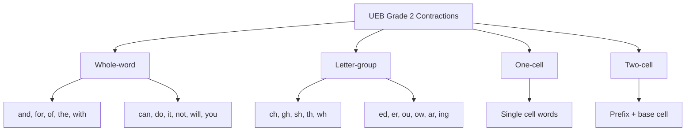
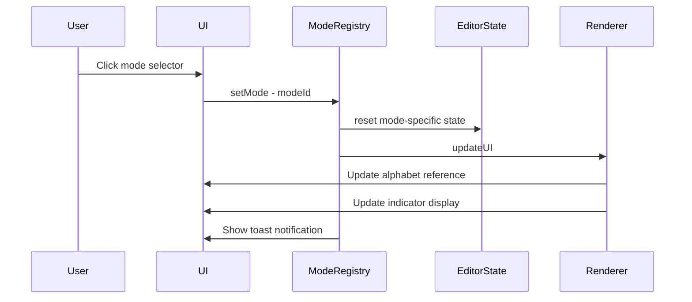
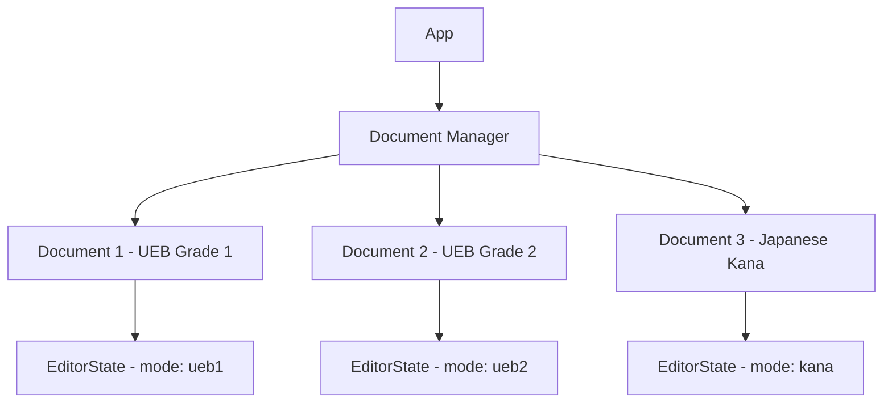

# Braille Editor Scalability Architecture Plan

## Overview

This document outlines a scalable architecture for extending the braille editor to support:
- **UEB Grade 2** (contracted braille with whole-word and letter-group contractions)
- **Japanese Kana Braille** (different character mapping system)
- **Prefix combinations** (flexible multi-cell sequences)
- **Mode switching** (seamless transitions between braille systems)

---

## Current Architecture Analysis

### Strengths
1. **Good separation of concerns**: [`braille-data.js`](braille-data.js) contains data tables, [`braille.js`](braille.js) contains logic
2. **Existing indicator system**: Multi-cell indicators (italic, bold, underline) already implemented with prefix detection
3. **Modular data structures**: `UEB_GRADE1`, `NUMBER_MAP`, `INDICATORS` are separate lookup tables
4. **Forward-thinking comments**: Line 10 in [`braille-data.js`](braille-data.js:10) mentions "Swap-friendly: Easy to add Grade 2, Japanese Braille, etc."

### Current Limitations
1. **Hardcoded UEB Grade 1**: [`codeToText()`](braille.js:147) directly references `UEB_GRADE1`
2. **No mode switching mechanism**: No way to switch between different braille systems
3. **Limited prefix handling**: Only handles indicator prefixes, not general contractions
4. **UEB-specific state**: [`EditorState`](braille.js:35) has fields like `numberMode`, `capitalMode` that are UEB-specific

---

## Proposed Architecture

### 1. BrailleMode Interface

Create a standardized interface that all braille modes must implement:

```javascript
// modes/BrailleMode.js
class BrailleMode {
  constructor(config) {
    this.name = config.name;           // "UEB Grade 1", "UEB Grade 2", "Japanese Kana"
    this.id = config.id;               // "ueb1", "ueb2", "kana"
    this.description = config.description;
  }

  // Required methods
  codeToText(code, context) { throw new Error('Not implemented'); }
  textToCode(text) { throw new Error('Not implemented'); }
  getIndicators() { return {}; }
  getAlphabet() { return {}; }
  
  // Optional overrides
  processSequence(codes, context) { return null; }
  getPrefixCodes() { return new Set(); }
  requiresContext() { return false; }
  
  // State management
  createInitialState() { return {}; }
  updateState(state, code, text) { return state; }
}
```

### 2. Mode Registry System

Central registry for managing available modes:

```javascript
// modes/ModeRegistry.js
class ModeRegistry {
  constructor() {
    this.modes = new Map();
    this.currentMode = null;
  }

  register(mode) {
    this.modes.set(mode.id, mode);
  }

  setMode(modeId) {
    if (!this.modes.has(modeId)) {
      throw new Error(`Unknown mode: ${modeId}`);
    }
    this.currentMode = this.modes.get(modeId);
    this.notifyModeChange();
  }

  getMode() {
    return this.currentMode;
  }
}
```

### 3. Directory Structure

```
braille-editor/
├── braille.html
├── braille.css
├── braille.js              # Main entry point (refactored)
├── braille-data.js         # Legacy data (kept for compatibility)
├── modes/
│   ├── BrailleMode.js      # Base class/interface
│   ├── ModeRegistry.js     # Mode management
│   ├── ueb/
│   │   ├── UEBGrade1Mode.js
│   │   ├── UEBGrade2Mode.js
│   │   ├── ueb-data.js     # Shared UEB data
│   │   └── contractions.js # Grade 2 contractions
│   └── japanese/
│       ├── KanaMode.js
│       └── kana-data.js
├── core/
│   ├── EditorState.js      # Generic state management
│   ├── InputHandler.js     # Keyboard/mouse input
│   └── Renderer.js         # UI rendering
└── plans/
    └── scalability-plan.md
```

---

## UEB Grade 2 Implementation

### Contraction System Design

UEB Grade 2 introduces **contractions** that map single braille cells or short sequences to whole words or letter groups.

#### Contraction Types



#### Contraction Data Structure

```javascript
// modes/ueb/contractions.js
const CONTRACTIONS = {
  // Whole-word contractions (standalone words)
  wholeWord: {
    0x2F: "and",    // ⠯
    0x3F: "for",    // ⠿
    0x37: "of",     // ⠷
    0x2E: "the",    // ⠮
    // ... more
  },
  
  // Letter-group contractions (part of words)
  letterGroup: {
    0x21: "ch",     // ⠡
    0x29: "sh",     // ⠩
    0x39: "th",     // ⠹
    0x2C: "ing",    // ⠬
    // ... more
  },
  
  // Two-cell contractions (prefix + cell)
  twoCell: {
    // Format: "prefixCode:baseCode" -> contraction
    "0x3F:0x03": "bb",   // ⠿⠃
    "0x3F:0x09": "cc",   // ⠿⠉
    "0x3F:0x0B": "ff",   // ⠿⠋
    // ... more
  }
};
```

#### Context-Aware Resolution

Grade 2 requires context to determine if a cell is:
- A contraction (whole word)
- A letter sequence (part of word)
- A punctuation mark

```javascript
class UEBGrade2Mode extends UEBGrade1Mode {
  resolveCode(code, context) {
    // Check if at word boundary
    const atWordStart = this.isAtWordStart(context);
    const atWordEnd = this.isAtWordEnd(context);
    
    // Whole-word contractions only valid at word boundaries
    if (atWordStart && CONTRACTIONS.wholeWord[code]) {
      return { type: 'wholeWord', text: CONTRACTIONS.wholeWord[code] };
    }
    
    // Letter-group contractions valid within words
    if (!atWordStart && CONTRACTIONS.letterGroup[code]) {
      return { type: 'letterGroup', text: CONTRACTIONS.letterGroup[code] };
    }
    
    // Fall back to Grade 1
    return super.resolveCode(code, context);
  }
}
```

---

## Japanese Kana Braille Implementation

### Character Mapping Differences

Japanese braille maps each kana character to a specific dot pattern:

```javascript
// modes/japanese/kana-data.js
const HIRAGANA_MAP = {
  // Vowels
  0x01: "あ",  // a
  0x08: "い",  // i
  0x02: "う",  // u
  0x10: "え",  // e
  0x20: "お",  // o
  
  // K-row
  0x05: "か",  // ka
  0x0D: "き",  // ki
  0x07: "く",  // ku
  0x15: "け",  // ke
  0x25: "こ",  // ko
  
  // ... more kana
};

// Dakuten (voicing marks) - dot 7 in 8-dot braille
// Or prefix cell in 6-dot representation
const DAKUTEN_PREFIX = 0x04;  // ⠄
const HANDAKUTEN_PREFIX = 0x08;  // ⠈
```

### Kana Mode Class

```javascript
// modes/japanese/KanaMode.js
class KanaMode extends BrailleMode {
  constructor() {
    super({
      name: "Japanese Kana",
      id: "kana",
      description: "Japanese braille for hiragana and katakana"
    });
    this.hiraganaMap = HIRAGANA_MAP;
    this.katakanaMode = false;
  }

  codeToText(code, context) {
    // Check for dakuten/handakuten prefix
    if (context.pendingPrefix === DAKUTEN_PREFIX) {
      return this.applyDakuten(code);
    }
    if (context.pendingPrefix === HANDAKUTEN_PREFIX) {
      return this.applyHandakuten(code);
    }
    
    return this.hiraganaMap[code] || "?";
  }

  getPrefixCodes() {
    return new Set([DAKUTEN_PREFIX, HANDAKUTEN_PREFIX]);
  }
}
```

---

## Mode Switching Mechanism

### UI Design

Add a mode selector to the sidebar:

```html
<!-- In braille.html -->
<div class="mode-selector" role="radiogroup" aria-labelledby="mode-heading">
  <h2 class="section-title" id="mode-heading">Braille Mode</h2>
  <div class="mode-options" id="mode-options">
    <!-- Dynamically populated -->
  </div>
</div>
```

### Keyboard Shortcut

```javascript
// Ctrl+M or Alt+M to cycle modes
document.addEventListener('keydown', e => {
  if ((e.ctrlKey || e.altKey) && e.key.toLowerCase() === 'm') {
    e.preventDefault();
    cycleToNextMode();
  }
});
```

### Mode Change Flow



---

## Prefix Combination System

### Generalized Prefix Handler

The current indicator prefix system can be extended for contractions:

```javascript
// core/PrefixHandler.js
class PrefixHandler {
  constructor() {
    this.prefixes = new Map();  // prefixCode -> handler
    this.sequences = new Map(); // "prefix:code" -> result
  }

  registerPrefix(code, handler) {
    this.prefixes.set(code, handler);
  }

  registerSequence(prefixCode, baseCode, result) {
    const key = `${prefixCode}:${baseCode}`;
    this.sequences.set(key, result);
  }

  isPrefix(code) {
    return this.prefixes.has(code);
  }

  resolve(prefixCode, baseCode, context) {
    const key = `${prefixCode}:${baseCode}`;
    const result = this.sequences.get(key);
    
    if (result) {
      const handler = this.prefixes.get(prefixCode);
      return handler ? handler(result, context) : result;
    }
    
    return null;
  }
}
```

### Integration with Modes

Each mode can register its own prefixes:

```javascript
class UEBGrade2Mode extends UEBGrade1Mode {
  constructor() {
    super();
    this.prefixHandler = new PrefixHandler();
    this.registerContractions();
  }

  registerContractions() {
    // Register two-cell contractions
    for (const [key, value] of Object.entries(CONTRACTIONS.twoCell)) {
      const [prefix, base] = key.split(':');
      this.prefixHandler.registerSequence(
        parseInt(prefix),
        parseInt(base),
        { type: 'doubleLetter', text: value }
      );
    }
  }
}
```

---

## Implementation Roadmap

### Phase 1: Foundation (Priority: High)
1. Create `BrailleMode` base class
2. Create `ModeRegistry` system
3. Refactor existing UEB Grade 1 into `UEBGrade1Mode`
4. Update [`EditorState`](braille.js:35) to be mode-agnostic
5. Add mode selector UI

### Phase 2: UEB Grade 2 (Priority: High)
1. Create contraction data tables
2. Implement `UEBGrade2Mode` extending `UEBGrade1Mode`
3. Add context-aware resolution
4. Update alphabet reference for contractions
5. Add contraction reference panel

### Phase 3: Japanese Kana (Priority: Medium)
1. Create kana data tables
2. Implement `KanaMode`
3. Add dakuten/handakuten prefix handling
4. Create kana reference grid
5. Add hiragana/katakana toggle

### Phase 4: Enhancements (Priority: Low)
1. Add mode-specific keyboard shortcuts
2. Implement mode persistence in localStorage
3. Add mode-specific help text
4. Create mode transition animations
5. Add import/export for different braille formats

---

## Technical Considerations

### Backward Compatibility
- Keep [`braille-data.js`](braille-data.js) for legacy support
- Default to UEB Grade 1 mode on first load
- Preserve existing keyboard layouts across modes

### Performance
- Lazy-load mode data (only load when mode is selected)
- Cache resolved contractions
- Debounce context analysis during rapid input

### Accessibility
- Announce mode changes to screen readers
- Provide mode-specific ARIA labels
- Ensure keyboard navigation works for mode selector

### Testing Strategy
- Unit tests for each mode class
- Integration tests for mode switching
- Cross-mode input tests
- Edge case tests for contractions

---

## Design Decisions

Based on user requirements:

1. **Priority order**: UEB Grade 2 will be implemented before Japanese Kana
2. **8-dot support**: Japanese mode will use **6-dot prefix approach** for dakuten/handakuten (not 8-dot)
3. **Mixed content**: Each document uses a single mode, but multiple documents can use different modes (tab-based or separate windows)

---

## Multi-Document Architecture

Since mixed content within a document is not required, we can simplify the architecture:



### Document Model

```javascript
class BrailleDocument {
  constructor(modeId) {
    this.id = generateId();
    this.modeId = modeId;
    this.state = new EditorState(modeId);
    this.content = {
      braille: '',
      text: ''
    };
  }
}
```
4. **Translation**: Should there be a feature to translate between braille modes (e.g., Grade 2 → Grade 1)?
